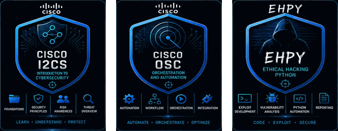

<h1 align="center">Flaudimar Souza</h1>

<p align="center">
  <strong>Analista de Segurança da Informação</strong><br>
  Blue Team | SOC | SIEM | DFIR | Detection Engineering
</p>

<p align="center">
  <a href="https://www.linkedin.com/in/flaudimar-souza/">
    
  </a>
</p>

<p align="center">
  
  
  
  
  
</p>

---

> **Minha linha de trabalho:** transformar sinais dispersos em contexto, contexto em decisão e decisão em resposta defensiva.

---

## 🏆 Badges & Credentials

<p align="center"><strong>FABRICANTES • PLATAFORMAS • CERTIFICAÇÕES</strong></p>

<p align="center">
  
</p>

<p align="center"><strong>ÁREAS DE ATUAÇÃO</strong></p>

<p align="center">
  
</p>

---

## Sobre mim

Atuo com foco em **Seguranca da Informacao e operacoes defensivas**, conectando monitoramento, analise de eventos, investigacao, engenharia de deteccao e mitigacao de riscos.

Meu ciclo de defesa:

```text
PREVENIR -> MONITORAR -> DETECTAR -> INVESTIGAR -> RESPONDER -> APRENDER
```

Meu foco esta em ambientes que exigem visibilidade, disciplina operacional e melhoria continua: **SOC, MSS, SIEM, DFIR, analise de logs, threat detection, threat hunting, resposta a incidentes e seguranca de redes**.

## Foco em seguranca defensiva

| Area | O que desenvolvo e investigo |
|---|---|
| **SOC / MSS** | Triagem, investigacao de alertas, escalonamento e documentacao |
| **SIEM** | Coleta, normalizacao, correlacao e reducao de ruido |
| **Detection Engineering** | Casos de uso, regras, validacao e cobertura de tecnicas |
| **Threat Hunting** | Hipoteses, comportamento, contexto e evidencias |
| **DFIR** | Preservacao, timeline, analise, contencao e recuperacao |
| **Network Security** | Firewalls, politicas, trafego, segmentacao e exposicao |
| **Security Engineering** | Automacao, hardening e controles reproduziveis |

<details>
<summary><strong>Como penso durante uma investigacao</strong></summary>

1. **Qual e o sinal?** Diferencio alerta, evento e evidencia.
2. **Qual e o contexto?** Identifico ativo, usuario, processo, horario e comportamento esperado.
3. **O que mudou?** Comparo baseline, historico e atividade relacionada.
4. **Qual e o impacto?** Priorizo risco e criticidade do ativo.
5. **Qual e a resposta segura?** Contenho sem destruir evidencias.
6. **Como evitamos recorrencia?** Transformo o aprendizado em controle ou melhoria.
</details>

## Stack e tecnologias

### SIEM, SOC e monitoramento

<p>
  
  
  
</p>

Monitoramento de segurança | Análise de logs | Investigação de alertas | Threat detection | Triagem | SOC / MSS

### Firewalls e redes

<p>
  
  
  
</p>

Políticas de acesso | Controle de tráfego | Superfície de ataque | Segmentação | Mitigação de riscos

### Engenharia e automação defensiva

<p>
  
  
  
  
</p>

Hardening | Coleta e validação | Evidências reproduzíveis | Pipelines | Baselines

## LEARN / START

Repositorios de referencia, curadoria e ponto de partida para estudo em seguranca da informacao:

| Projeto | Area | Objetivo |
|---|---|---|
| [`Awesome-Security-Information`](https://github.com/FTRep01/Awesome-Security-Information) | Curadoria geral | Reunir referencias e materiais de seguranca da informacao |
| [`Awesome-Security-Frameworks`](https://github.com/FTRep01/Awesome-Security-Frameworks/) | Frameworks | Curadoria de frameworks de seguranca |
| [`OSINT-Awesome-Modern`](https://github.com/FTRep01/OSINT-Awesome-Modern) | OSINT | Curadoria de ferramentas e tecnicas modernas de OSINT |
| [`Incident-Response-Playbooks`](https://github.com/FTRep01/Incident-Response-Playbooks) | DFIR / IR | Playbooks de resposta a incidentes |
| [`DevSecOps-Playbook`](https://github.com/FTRep01/DevSecOps-Playbook) | DevSecOps | Praticas e playbook de seguranca no ciclo de desenvolvimento |
| [`Awesome-Cloud-Security`](https://github.com/FTRep01/Awesome-Cloud-Security) | Cloud Security | Curadoria de seguranca em nuvem |
| [`Awesome-AI-Security-RedTeaming`](https://github.com/FTRep01/Awesome-AI-Security-RedTeaming/) | AI Security | Curadoria de seguranca e red teaming aplicados a IA |
| [`Awesome-BlueTeaming-Operations`](https://github.com/FTRep01/Awesome-BlueTeaming-Operations) | Blue Team | Curadoria de operacoes e praticas de Blue Team |

## Projetos defensivos

Estes sao os projetos principais do meu portfolio Blue Team:

| Projeto | Area | Objetivo |
|---|---|---|
| [`DEF-Detection-Engineering-Lab-v2.0`](https://github.com/FTRep01/DEF-Detection-Engineering-Lab-v2.0) | Detection Engineering | Criar, validar e documentar regras e casos de uso |
| [`DEF-Dfir-Sentinel`](https://github.com/FTRep01/DEF-Dfir-Sentinel) | DFIR | Organizar evidencias, timelines, investigacoes e resposta |
| [`DEF-Hardening-Atlas`](https://github.com/FTRep01/DEF-Hardening-Atlas) | Hardening | Auditar e reduzir exposicao em Linux e Windows |
| [`DEF-Recon-Atlas`](https://github.com/FTRep01/DEF-Recon-Atlas) | Recon defensivo | Inventariar DNS, subdominios, portas e caminhos autorizados |
| [`DEF-API-Sentinel`](https://github.com/FTRep01/DEF-API-Sentinel) | API Security | Testar BOLA, rate limiting, contratos e headers |

## Cloud & DevOps Security

A segurança em nuvem é altamente valorizada no mercado atual. Estes projetos demonstram infraestrutura vulnerável propositalmente, seu respectivo hardening e a varredura de vulnerabilidades em containers.

| Projeto | Area | Objetivo |
|---|---|---|
| [`CLD-Terraform-Vulnerable-IAC`](https://github.com/FTRep01/CLD-Terraform-Vulnerable-IAC) | IaC / Terraform | Repositorio demonstrando a criacao de infraestrutura de nuvem propositalmente vulneravel (estilo Terragoat), com o respectivo relatorio de correcao |
| [`CLD-IAC-VULN-LAB`](https://github.com/FTRep01/CLD-IAC-VULN-LAB) | IaC / Terraform | Laboratorio de vulnerabilidades em Infraestrutura como Codigo |
| [`CLD-Docker-Security-Hardening`](https://github.com/FTRep01/CLD-Docker-Security-Hardening) | Container Security | Exemplos de Dockerfiles inseguros vs. corrigidos (hardening de containers) |
| [`CLD-DOCKER-SECURITY-LAB`](https://github.com/FTRep01/CLD-DOCKER-SECURITY-LAB) | Container Security | Varredura de vulnerabilidades em containers usando ferramentas como Trivy ou Clair |

### Como os projetos se conectam

```text
RECON ATLAS
    -> ativos e superficie autorizada
HARDENING ATLAS
    -> baseline e reducao de exposicao
API SENTINEL
    -> autorizacao e comportamento de APIs
DETECTION ENGINEERING LAB
    -> regras, casos de uso e validacao
DFIR SENTINEL
    -> evidencias, investigacao e resposta
CLOUD and DEVOPS SECURITY
    -> IaC vulneravel, hardening de containers e varredura de vulnerabilidades
```

## Blue Team em pratica

```text
+--------------------------------------------------------------+
|                    DEFENSIVE OPERATING LOOP                  |
+--------------------------------------------------------------+
|  01  VISIBILIDADE   -> logs, ativos, identidades e contexto   |
|  02  DETECCAO       -> regras, hipoteses e anomalias          |
|  03  INVESTIGACAO   -> timeline, escopo e evidencias         |
|  04  RESPOSTA       -> conter, comunicar e documentar        |
|  05  RECUPERACAO    -> restaurar, validar e acompanhar       |
|  06  APRENDIZADO    -> melhorar controles e deteccoes        |
+--------------------------------------------------------------+
```

## CTF, labs e pesquisa controlada

A parte ofensiva do portfolio e exclusivamente educacional, autorizada e realizada em laboratorios ou CTFs.

| Projeto | Tema |
|---|---|
| [`CTF-Web-Investigation`](https://github.com/FTRep01/CTF-Web-Investigation) | Investigacao de aplicacoes web |
| [`CTF-Walkthrough-SQLi-WebShell`](https://github.com/FTRep01/CTF-Walkthrough-SQLi-WebShell) | Analise de vulnerabilidades em laboratorio |
| [`CTF-TA0043-Reconnaissance`](https://github.com/FTRep01/CTF-TA0043-Reconnaissance) | Reconnaissance em ambiente controlado |
| [`CTF-TA001-Initial_Access`](https://github.com/FTRep01/CTF-TA001-Initial_Access) | Initial Access em ambiente controlado |
| [`CTF-TA004-Privilege_Escalation`](https://github.com/FTRep01/CTF-TA004-Privilege_Escalation) | Privilege Escalation em laboratorio |
| [`CTF-TA0007-Discovery`](https://github.com/FTRep01/CTF-TA0007-Discovery) | Discovery e mapeamento de tecnicas |
| [`CTF-TA0008-Lateral-Movement`](https://github.com/FTRep01/CTF-TA0008-Lateral-Movement) | Lateral Movement em cenario simulado |
| [`CTF-TA0010-Exfiltration`](https://github.com/FTRep01/CTF-TA0010-Exfiltration) | Exfiltration em cenario simulado |
| [`CTF-MitreAttack`](https://github.com/FTRep01/CTF-MitreAttack) | Estudos baseados em MITRE ATTandCK |
| [`CTF-Operation-Nightfall`](https://github.com/FTRep01/CTF-Operation-Nightfall) | Investigacao e resposta simulada |
| [`CTF-SANS-European-Championship-2026-v1.1`](https://github.com/FTRep01/CTF-SANS-European-Championship-2026-v1.1) | Write-up do SANS European Championship 2026 |
| [`CTF-FEBRABAN-WRITEUP`](https://github.com/FTRep01/CTF-FEBRABAN-WRITEUP) | Write-up de laboratorio de seguranca financeira |

## Matriz de competencias

| Dominio | Foco pratico |
|---|---|
| Blue Team | Defesa, hardening e reducao de exposicao |
| SOC / MSS | Monitoramento, triagem e escalonamento |
| SIEM | Logs, correlacao, alertas e investigacao |
| Detection Engineering | Casos de uso, regras e validacao |
| Threat Hunting | Hipoteses, comportamento e evidencias |
| DFIR | Preservacao, timeline, resposta e recuperacao |
| Incident Response | Contencao, recuperacao e melhoria |
| Network Security | Firewalls, politicas e trafego |
| API Security | Autorizacao, contratos e limites de consumo |

## Atualmente focado em

```text
[+] Security Operations Center
[+] SIEM e analise de logs
[+] Detection Engineering
[+] Threat Detection
[+] Threat Hunting
[+] DFIR e Incident Response
[+] Network Security e Firewalls
[+] Hardening e automacao defensiva
[+] Seguranca de APIs
[+] MITRE ATTandCK aplicado a defesa
[+] Laboratorios e CTFs autorizados
```

## Security philosophy

> <strong>Security is not only about preventing attacks. It is about building enough visibility to detect, enough context to investigate, and enough discipline to respond and improve.</strong>
